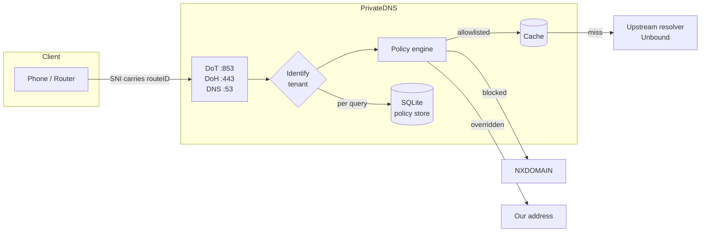

# PrivateDNS

A self-hostable, multi-tenant filtering DNS platform. Each customer gets their
own hostname, and the tenant identity travels in the TLS handshake — so the
resolver knows whose policy to apply before a single query is answered.

```
customer sets Private DNS to:  k7mp2qx9rt.dns.example.com
                               └────┬────┘ └──────┬─────┘
                                 routeID      base domain
```

Built as a single static Go binary with an embedded SQLite policy store. No
Redis, no cgo, no runtime dependencies.

[](LICENSE)

> **Status: early development.** The resolver, backend API and customer portal
> are working and tested. The admin dashboard and installer are not built yet —
> see [Roadmap](#roadmap). Do not run this in production.

## How it works



Every query runs the same pipeline, in this order:

1. **Allowlist** — the tenant's rules, then global. Beats everything below.
2. **Override** — answer with an address we control instead of the real one.
3. **Blocklist** — `NXDOMAIN`, unless the tenant has paused filtering.
4. **Cache**, then **upstream**.

Unrecognised, expired and suspended tenants receive `REFUSED`. The resolver is
never open to the public, which is what keeps it off amplification-abuse lists.

## Features

| Capability | Status |
|---|---|
| DNS-over-TLS with SNI tenant identification | working |
| DNS-over-HTTPS (RFC 8484) | working |
| Plain DNS with source-IP identification | working |
| Blocklist filtering, hot-reloaded | working |
| Answer overrides, wildcard-matching | working |
| Per-tenant allowlist | working |
| Subscription expiry and revocation | working |
| Pause filtering (false-positive escape hatch) | working |
| Provisioning REST API | working |
| Per-tenant rate limiting | working |
| EDNS Client Subnet stripping | working |
| Health checks that probe real dependencies | working |
| Aggregate per-tenant usage counters | working |
| Versioned database migrations | working |
| Prometheus metrics | working |
| Backend API with sessions, API tokens and RBAC | working |
| Tenant isolation across resellers and customers | working |
| Append-only audit log | working |
| Generated OpenAPI specification | working |
| Customer portal, bilingual and installable | working |
| iOS configuration profile generator | working |
| DNS-check diagnostic | working |
| Admin dashboard | planned |
| Installer, Docker, packages | planned |

## Quick start

Requires Go 1.24+. Nothing else — the SQLite driver is pure Go.

```bash
git clone https://github.com/Sakawat-hossain/PrivateDNS.git
cd PrivateDNS
make build
```

Create a configuration:

```bash
cp configs/config.example.yaml config.yaml
```

Edit `config.yaml` — at minimum set `base_domain`, `upstreams`, the certificate
paths, and generate an admin token with `openssl rand -hex 32`.

Every key can also be set from the environment as `PRIVATEDNS_<KEY>`, which
wins over the file — that is how one container image serves several
deployments without being rebuilt:

```bash
export PRIVATEDNS_BASE_DOMAIN=dns.example.com
export PRIVATEDNS_UPSTREAMS=10.0.0.2:53,10.0.0.3:53
```

Both YAML and JSON are accepted; the format follows the file extension.

```bash
./privatedns-resolver -config config.yaml
```

## DNS records

Two records, both pointing at your server:

| Type | Name | Value |
|---|---|---|
| A | `dns` | your server's IP |
| A | `*.dns` | your server's IP |

> **If your DNS is on Cloudflare, both records must be grey-cloud / DNS-only.**
> The orange-cloud proxy carries HTTP only. It cannot pass port 53 or 853, and
> enabling it breaks the service in a way that looks exactly like a firewall
> problem.

## Certificates

Per-tenant hostnames need a **wildcard** certificate, and a wildcard can only be
issued over the ACME **DNS-01** challenge — HTTP-01 cannot produce one.

`deploy/scripts/issue-cert.sh` handles issuance and renewal through `lego`. It
reads the DNS provider credential from a root-only file you create on the
server:

```bash
sudo sh -c 'printf "CF_DNS_API_TOKEN=your_token\n" > /etc/private-dns/cloudflare.env'
sudo chmod 600 /etc/private-dns/cloudflare.env
sudo ACME_EMAIL=you@example.com BASE_DOMAIN=dns.example.com \
     deploy/scripts/issue-cert.sh run
```

**No credential ever belongs in this repository.** The token needs exactly one
permission: DNS edit, scoped to your zone.

The resolver re-reads its certificate from disk within a minute of it changing,
so renewals need no restart and drop no connections.

## Creating a tenant

```bash
curl -sX POST http://127.0.0.1:8053/v1/tenants \
  -H "Authorization: Bearer $ADMIN_TOKEN" \
  -H 'Content-Type: application/json' \
  -d '{"label":"first customer","days":30}'
```

```json
{
  "route_id": "k7mp2qx9rt",
  "hostname": "k7mp2qx9rt.dns.example.com",
  "expires_at": 1793404800
}
```

## Client setup

**Android** — Settings → Network & internet → Private DNS → *Private DNS
provider hostname* → enter the tenant hostname.

**Verify from any machine:**

```bash
kdig @dns.example.com +tls-hostname=k7mp2qx9rt.dns.example.com +tls example.com
```

**iOS** has no user interface for DNS-over-TLS at all. The customer portal
generates a per-tenant configuration profile at `/profile.mobileconfig`, which
the customer opens and installs through Settings.

## API

Every route except `/metrics` and `/healthz` requires
`Authorization: Bearer <token>`.

| Method | Path | Purpose |
|---|---|---|
| POST | `/v1/tenants` | Create. `label` plus one of `days`, `minutes`, `expires_at`. |
| GET | `/v1/tenants/{id}` | Current state. |
| POST | `/v1/tenants/{id}/extend` | Renew; reactivates a suspended tenant. |
| POST | `/v1/tenants/{id}/revoke` | Suspend. Effective within one second. |
| POST | `/v1/tenants/{id}/pause` | Stop filtering temporarily. |
| POST | `/v1/ips` | Bind a source IP to a tenant. |
| DELETE | `/v1/ips/{ip}` | Unbind. |
| POST | `/v1/overrides` | `domain`, `answer`, optional `route_id`. |
| POST | `/v1/allow` | `domain`, optional `route_id`. |
| GET | `/v1/tenants/{id}/usage` | Aggregate counters. No per-domain history exists to return. |
| GET | `/health` | Liveness. Always 200 while the process runs. |
| GET | `/ready` | Readiness. Probes store, schema, certificate expiry and a real upstream resolution; 503 if any fails. |
| GET | `/version` | Build and schema version. |
| GET | `/metrics` | Prometheus text format. |

## Security

The admin API binds to `127.0.0.1` by default. **Never expose it to the
internet.** Put it behind an authenticated reverse proxy or a private network if
remote access is genuinely needed.

Other deployment rules that matter:

- Keep `open_plain` set to `false`. An open resolver is an amplification vector.
- Never place DNS or DoT behind an HTTP reverse proxy. Only the web interface
  belongs behind Nginx.
- Run as a dedicated unprivileged user. The supplied systemd unit grants
  `CAP_NET_BIND_SERVICE` rather than running as root.

To report a vulnerability, see [SECURITY.md](SECURITY.md). Please do not open a
public issue for security problems.

## Design notes

Two decisions worth knowing about, because both look like bugs until explained.

**Revocation latency is bounded at one second.** The policy snapshot rebuilds
from SQLite every second, and the tenant is looked up *per query* rather than
per connection. A lapsed subscription therefore stops resolving even on a DoT
connection a phone has held open for hours.

**Rate limits exist because a tenant hostname is not a secret.** It travels in
the SNI in cleartext and customers share them, so without a per-tenant limit one
leaked hostname can be used to flood the resolver on that tenant's behalf.

**EDNS Client Subnet is stripped from forwarded queries.** ECS tells the
upstream which subnet the customer is on — a per-lookup location signal handed
to a third party, which would contradict the product.

**An IPv4 override deliberately answers `AAAA` with an empty `NOERROR`**, and
suppresses `HTTPS`/`SVCB` records for overridden names. Returning the real IPv6
address would let a dual-stack client prefer IPv6 and bypass the override
entirely; `HTTPS` records carry their own address hints and would do the same.

## Backend API

A second binary, `privatedns-backend`, serves administration and provisioning.
It shares the resolver's database rather than keeping its own, so a revocation
takes effect on the API, the resolver and the proxy at once.

```bash
sudo cp configs/backend.example.yaml /etc/private-dns/backend.yaml
PRIVATEDNS_ADMIN_PASSWORD='your-password' privatedns-backend -create-admin you@example.com
privatedns-backend -config /etc/private-dns/backend.yaml
```

The password comes from the environment rather than a flag because command-line
arguments are visible to every process on the host through the process table.
There is no self-registration: the first account is created deliberately.

The full route list is at `/openapi.json`, generated from the same catalogue the
router is built from so it cannot drift.

### Authentication

Two mechanisms, for two kinds of caller:

- **Session cookies** for browsers. `HttpOnly`, `Secure`, `SameSite=Lax`, with a
  CSRF token returned in the login response body that must be echoed in the
  `X-CSRF-Token` header on every mutating request.
- **API tokens** for machines. Prefixed `pdns_`, shown once, stored only as a
  SHA-256 hash. Bearer tokens are exempt from CSRF by construction — a browser
  never attaches an `Authorization` header cross-site.

Passwords are hashed with argon2id at the OWASP baseline parameters.

### Roles and scopes

| Role | Sees |
|---|---|
| `admin` | Everything, including the audit log and answer overrides |
| `reseller` | Only the customers it owns, and their tenants |
| `customer` | Only its own tenants |

A token can never carry a scope its owner's role does not permit, and the check
runs per request — so demoting a user immediately narrows every token they had
already issued.

`tenants:bind_ip` is deliberately separate from `tenants:write`. Binding a
source address is the customer-facing "update my IP" control; issuing and
extending subscriptions is not something a customer should be able to do.

### What a denial looks like

Access denied on a tenant or customer returns **404, not 403**. A 403 would
confirm the record exists, which is enough for one reseller to enumerate a
competitor's customer identifiers.

## Customer portal

A third binary, `privatedns-portal`, is what customers actually use. It is
separate from the backend API on purpose: the portal is meant to face the
public internet, the administration API is not, and one process would force a
single exposure decision on both.

```bash
sudo cp configs/portal.example.yaml /etc/private-dns/portal.yaml
privatedns-portal -config /etc/private-dns/portal.yaml
```

Server-rendered Go with embedded templates rather than a JavaScript
application. It is a handful of pages, it ships inside the binary with no build
step, and a customer on a metered connection abroad does not pay for a bundle.

### What it does

- **Update my IP**, one tap. The most-used control in the product: a customer
  abroad moves between mobile data and Wi-Fi constantly, and each move changes
  the address the proxy tier authorises against. It always binds the address
  the request arrived from, never one the client nominates.
- **iOS configuration profile**, generated per tenant. iOS has no interface for
  DoT, so without this every iPhone customer is a support conversation.
- **DNS check**, reachable without signing in. A web page cannot read the
  system resolver, so it asks for a hostname nobody has ever looked up and the
  resolver reports whether that query arrived. That single fact resolves most
  "I set it up but it is not working" conversations.
- **Pause filtering** for five minutes, so a false positive is self-service.
- **Bengali and English**, switchable. Both competitors ship Bengali-first
  interfaces, and it is clearly working for them.
- **Installable as a PWA**, which sidesteps app-store review for a category
  stores are hostile to.

### One deployment detail that matters

Behind nginx, `X-Forwarded-For` must be set **and** the proxy listed in the
portal's `trusted_proxies`. The portal binds whatever source address it
observes, so without both, every customer would be bound to nginx's loopback
address and the proxy tier would authorise nobody.

## Development

```bash
make check    # gofmt, go vet, and the full test suite
make test     # tests only
make release  # cross-compile linux/amd64 and linux/arm64
make help     # all targets
```

The integration tests stand up a real TLS listener with a self-signed wildcard
certificate and perform genuine DoT exchanges, asserting on filtering,
overrides, refusal of unknown tenants, and revocation.

## Roadmap

| Stage | Scope |
|---|---|
| ~~1~~ | ~~Resolver hardening~~ — done |
| ~~2~~ | ~~Backend API — authentication, RBAC, audit log~~ — done |
| ~~3~~ | ~~Customer portal — IP registration, iOS profiles, diagnostics~~ — done |
| 4 | Admin dashboard |
| 5 | Deployment — Docker, Debian packages, installer |
| 6 | CI/CD, signed releases, security review |

## Contributing

See [CONTRIBUTING.md](CONTRIBUTING.md). For anything larger than a bug fix,
please open an issue first.

## License

[AGPL-3.0](LICENSE). If you run a modified version as a network service, you
must make your changes available to its users.
